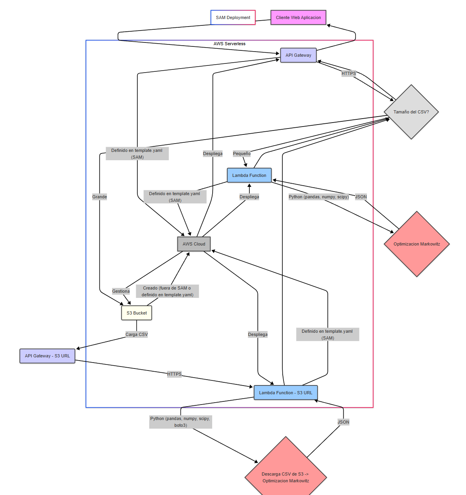

# Arquitectura serverless para el despliegue del servicio de optimización de portafolios

## Componentes

- Cliente (Web/Aplicación): El usuario o la aplicación que envía solicitudes para optimizar portafolios.
- API Gateway: El punto de entrada público de la API, que recibe las solicitudes y las dirige al componente adecuado.
- Tamaño del CSV?: Una decisión lógica para determinar si el archivo CSV es lo suficientemente pequeño para ser procesado directamente por Lambda o si requiere el uso de S3.
- Lambda Function (Archivo Pequeño): Una función de AWS Lambda que procesa archivos CSV pequeños directamente para realizar la optimización.
- S3 Bucket: Un servicio de almacenamiento de objetos de AWS utilizado para almacenar archivos CSV grandes.
- API Gateway - S3 URL: Un punto de entrada de API Gateway que espera la URL de un archivo CSV en S3 para su procesamiento.
- Lambda Function - S3 URL: Una función de AWS Lambda que descarga archivos CSV desde S3 y luego realiza la optimización.
- Optimización Markowitz: El proceso de cálculo de la asignación óptima del portafolio utilizando el modelo de Markowitz.
- AWS Cloud (SAM Deployment): Representa la nube de AWS y el proceso de despliegue de la infraestructura utilizando AWS SAM y CloudFormation.
- template.yaml (SAM): El archivo de configuración que define los recursos de AWS (API Gateway, Lambdas) para su despliegue a través de SAM.

El diagrama ilustra cómo las solicitudes de optimización son gestionadas por API Gateway y procesadas por funciones Lambda, con una ruta alternativa que utiliza S3 para manejar archivos CSV de gran tamaño, todo orquestado para su despliegue en AWS a través de SAM.

## Justificación

- Escalabilidad Automática: AWS Lambda escala automáticamente para manejar el número de solicitudes sin necesidad de configuración manual. API Gateway también es altamente escalable.
- Pago por Uso: Solo pagas por el tiempo de computación que consume la función Lambda y por las solicitudes a API Gateway. No hay costos por servidores inactivos.
- Menor Sobrecarga Operativa: AWS gestiona la infraestructura subyacente, lo que reduce la carga operativa en comparación con la gestión de servidores o contenedores.
- Despliegue Simplificado: AWS SAM permite definir y desplegar toda la infraestructura de manera declarativa, facilitando la gestión y la reproducibilidad.
- Integración Nativa: API Gateway se integra perfectamente con Lambda y otros servicios de AWS.

Esta arquitectura serverless con AWS Lambda y API Gateway, gestionada con AWS SAM, ofrece una manera eficiente y escalable de disponibilizar tu servicio de optimización de portafolios en la nube de AWS, especialmente para casos donde el tamaño del archivo CSV no excede las limitaciones de Lambda (o utilizando la estrategia de S3 para archivos más grandes).